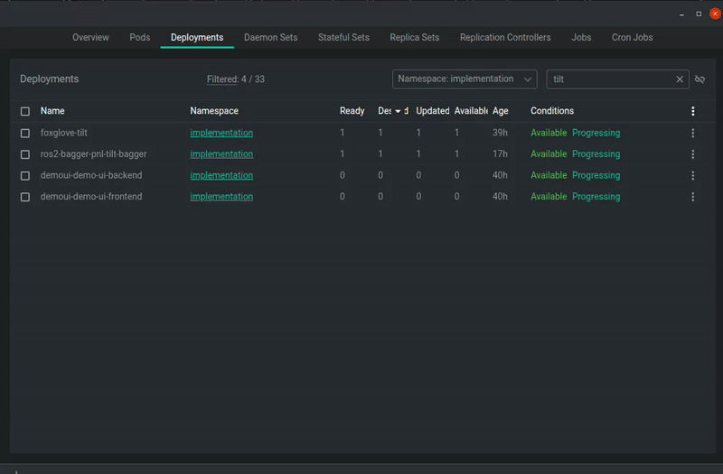

# Bulk Scaler for FreeLens

[](https://freelens.app/)
[](LICENSE)

Расширение для **FreeLens** (аналог Lens), которое добавляет возможность масштабировать Kubernetes Deployment'ы в **0** или **1** реплику одним кликом. Поддерживает как одиночные объекты, так и массовое выделение нескольких Deployment'ов.

## 🎬 Демонстрация



> *Нажмите на контекстное меню любого Deployment и выберите нужное действие*

## ✨ Возможности

- ⚡ **Быстрое масштабирование** — скейл в 0 или 1 реплику в один клик
- 📦 **Массовые операции** — выделите несколько Deployment'ов и примените действие ко всем сразу
- 🎯 **Контекстное меню** — интеграция в нативное меню FreeLens
- 🔔 **Уведомления** — информирование об успешном выполнении или ошибках
- 🛡️ **Безопасность** — работает только с Deployment'ами, не затрагивает другие ресурсы

## 📋 Требования

| Компонент | Версия |
|-----------|--------|
| FreeLens  | ≥ 1.8.1 |
| Kubernetes API | apps/v1 |

## 📦 Установка

### Через UI FreeLens

1. Откройте FreeLens
2. Перейдите в меню **File → Extensions**
3. Вставьте URL:
   ```
   https://github.com/MrBoriska/freelens_bulk_scaler/raw/refs/heads/master/bulk-scaler.tgz
   ```
4. Нажмите **Install**

### 🔧 Исправление проблем с путями

Если после установки возникли ошибки, создайте симлинк (замените `username` на ваше имя пользователя):

```bash
# Перейдите в папку, где FreeLens ищет модули
cd /home/username/.config/Freelens/node_modules/

# Удалите битую ссылку (если есть)
rm -rf bulk-scaler

# Создайте правильную ссылку на установленное расширение
ln -s /home/username/.freelens/extensions/bulk-scaler bulk-scaler
```

## 🚀 Использование

1. Откройте панель **Deployments** в FreeLens
2. Выберите один или несколько Deployment'ов (Ctrl/Cmd + клик для множественного выбора)
3. Кликните **правой кнопкой мыши** для открытия контекстного меню
4. Выберите нужное действие:
   - **Bulk Scale Selected to 0** — масштабировать в 0 реплик
   - **Bulk Scale Selected to 1** — масштабировать в 1 реплику
5. Проверьте уведомления о результате операции

## 📁 Структура проекта

```
freelens_bulk_scaler/
├── README.md          # Документация
├── package.json       # Метаданные расширения
├── renderer.js        # Основной код расширения
└── docs/
    └── bulk-scaler-demo.gif  # Демонстрация работы
```

## 🛠️ Разработка

### Локальная установка для разработки

```bash
# Клонируйте репозиторий
git clone https://github.com/MrBoriska/freelens_bulk_scaler.git
cd freelens_bulk_scaler

# Установите расширение в FreeLens
ln -s $(pwd) ~/.freelens/extensions/bulk-scaler
```

### Структура кода

- `renderer.js` — точка входа расширения, содержит класс `BulkScalerExtension`
- Использует API `K8sApi.deploymentApi` для взаимодействия с Kubernetes
- Интегрируется через `kubeObjectMenuItems` для Deployment'ов

